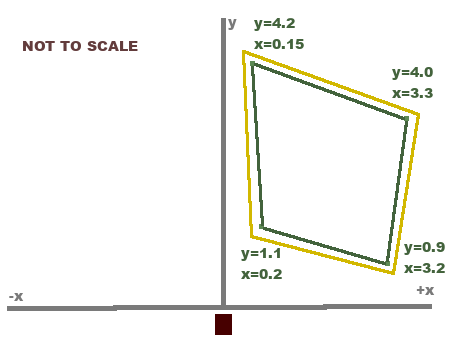

# ESPHome Hi-Link HKL-LD2450

This external [ESPHome](https://esphome.io) component adds support for the [Hi-Link HKL-LD2450](https://www.hlktech.net/index.php?id=1157) Human presence sensor to ESPHome.
In addition to a basic binary presence sensor, this component adds various different sensors for each detected target and supports custom presence detection Zones.

## Recommended configuration

1. Set up a single target with debugging enabled and view the logs (i.e. using `esphome logs`).
2. Determine the corners of your zones by moving around and taking note of the `x` and `y` coordinates.
3. Create zones based on these coordinates and add an occupancy sensor to each zone.
4. Remove the debugging target

This will give you binary occupancy sensors for individual zones.
Adding a small `off_delay` filter is recommended for tracking stability.
Zones can overlap one another. A good use-case example for this is the following:
Consider a room in which the sensor is mounted, such that it is off-angle with a door. If the sensor can track through the door, this may be undesired behavior.
Creating a zone that outlines the room can help solve this issue.



This sketch is intended to help understand zones and margins.
The y-axis is referred to as the axis pointing straight away from the sensor. The x-axis is located perpendicularly. A Target is tracked once it enters the polygon given by the configuration (green polygon within the sketch). Once tracked, a Target is allowed to move freely within the yellow polygon. This larger area is given by the base polygon and the `margin`.
If a tracked target leaves the yellow area it is not tracked anymore and the zone becomes unoccupied. Additionally, it won't be tracked immediately again since it is now outside of the green zone.

## Configuration variables

```yaml
LD2450:
  uart_id: uart_bus
  occupancy:
    name: Occupancy
```

This is the most basic `useful` configuration. You can find [this](examples/basic.yaml) example alongside other more complex examples in the example folder of this repository. An example configuration with all possible sensors and configurations can be found [here](examples/full.yaml).

### LD2450

- **uart_id**(**Required**, string): ID of the UART-Component to the LD2450 Sensor. Note that only the RX ping is required.
- **name**(**Optional**, string): The name of this sensor, which is used during logging. Defaults to `LD2450`.
- **flip_x_axis**(**Optional**, boolean): If set to true, values along the X-axis will be flipped. Defaults to `false`.
- **fast_off_detection**(**Optional**, boolean): If set to true, fast-away detection will be used for targets, which leave the visible range of the sensor. Defaults to `false`.
- **max_detection_distance**(**Optional**, number or distance): The furthest allowed detection distance. All targets further than this distance will not be tracked. Either a configuration for a number input or a fixed distance value. See: [Max Distance Number](#max-distance-number).
- **max_distance_margin**(**Optional**, ): The margin which is added to the maximum allowed distance. Targets that are already being tracked, will still be tracked within the additional margin. This prevents on-off-flickering of related sensors. Defaults to `25cm`.
- **occupancy**(**Optional**, binary sensor): A binary sensor, which will be triggered if at least one target is present. `id` or `name` required. All options from [Binary Sensor](https://esphome.io/components/binary_sensor/#config-binary-sensor).
- **target_count**(**Optional**, sensor): A sensor that provides the number of currently tracked targets. `id` or `name` required. All options from [Sensor](https://esphome.io/components/sensor/#config-sensor).
- **targets**(**Optional**, list of targets): A list of at most `3` Targets. Each target has its own configuration and sensors. See [Target](#target).
- **zones**(**Optional**, list of zones): A list Zones. Each zone has its own configuration and sensors. See [Zone](#zone).

### Max Distance Number

Instead of a fixed maximum distance, a user-defined number component can be defined. The values of this component will be used as the furthest allowed distance.

- **name**(**Required**, string): Name of the maximum distance number component.
- **initial_value**(**Optional**, distance): The initial value of this sensor. Defaults to `6m`. This value will be ignored if `restore_value` is enabled.
- **step**(**Optional**, distance): Step size of the input number. Defaults to `10cm`.
- **restore_value**(**Optional**, boolean): Tries to restore the last value from Flash upon reboot. Defaults to `true`.

All other options from [number](https://esphome.io/components/number/#base-number-configuration).

### Target

The name of target sub-sensor will be prefixed with the target name. For instance, if the Target is called `Target 1` and a sub-sensor of this target is named `X Position`, the actual name of the Sensor will be `Target 1 X Position`.
Each sensor requires at least an `id` or a `name` configuration.
The default polling rate is `1s`. If you end up using these sensors I would recommend excluding them from your [Home Assistant Recorder](https://www.home-assistant.io/integrations/recorder/#exclude).

- **name**(**Optional**, string): The name of the target. This name will be used as a prefix for sub-sensors. Per default, targets will be named `Target x` with increasing values for `x`.
- **debug**(**Optional**, boolean): Enables debugging for this target. The raw sensor values for this target will be logged periodically. Defaults to `false`.
- **x_position**(**Optional**, sensor): A sensor that reports the X Position of the target. The default name is `X Position`. All other options from [Sensor](https://esphome.io/components/sensor/#config-sensor).
- **y_position**(**Optional**, sensor): A sensor that reports the Y Position of the target. The default name is `Y Position`. All other options from [Sensor](https://esphome.io/components/sensor/#config-sensor).
- **speed**(**Optional**, sensor): A sensor that reports the measured speed of the target in `m/s`. The default name is `Speed`. All other options from [Sensor](https://esphome.io/components/sensor/#config-sensor).
- **distance_resolution**(**Optional**, sensor): A sensor that reports the reported distance resolution of the target. The default name is `Distance Resolution`. All other options from [Sensor](https://esphome.io/components/sensor/#config-sensor).
- **angle**(**Optional**, sensor): A sensor that reports the angle of the target in relation to the sensor in `°`. The default name is `Angle`. All other options from [Sensor](https://esphome.io/components/sensor/#config-sensor).
- **distance**(**Optional**, sensor): A sensor that reports the distance from the target to the sensor in `m`. The default name is `Distance`. All other options from [Sensor](https://esphome.io/components/sensor/#config-sensor).

A valid configuration may look like [this](examples/target_sensors.yaml) or this:

```yaml
  targets:
    - target:
        debug: true
        angle:
            id: t1_angle
```

### Zone

The name of zone sub-sensor will be prefixed with the zone name. For instance, if the zone is called `Dining Table` and a sub-sensor of this zone is named `Occupancy`, the actual name of the Sensor will be `Dining Table Occupancy`.

- **name**(**Required**, string): The name of the zone. This name will be used as a prefix for sub-sensors.
- **polygon**(**Required**, polygon): A simple convex polygon with at least 3 vertices. See [Polygon](#polygon).
- **margin**(**Optional**, distance): The margin that is added to the zone. Targets that are already being tracked, will still be tracked within the additional margin. This prevents on-off-flickering of related sensors. Defaults to `25cm`.
- **occupancy**(**Optional**, binary sensor): A binary sensor, that will be triggered if at least one target is tracked inside the zone. `id` or `name` required. The default name is empty, which results in the sensor being named after the zone. All options from [Binary Sensor](https://esphome.io/components/binary_sensor/#config-binary-sensor).
- **target_count**(**Optional**, sensor): A sensor that provides the number of currently tracked targets within the zone. `id` or `name` required. The default name is empty, which results in the sensor being named after the zone. All options from [Sensor](https://esphome.io/components/sensor/#config-sensor).

A valid configuration may look like [this](examples/zones.yaml) or this:

```yaml
  zones:
    - zone:
        name: "Dining table"
        margin: 25cm
        polygon:
          - point:
          ...
        occupancy:
          id: or_occupancy
        target_count:
          id: or_target_count
```

### Polygon

A polygon is made up of multiple points in physical space. The polygon must be a simple convex polygon.

- **x**(**Required**, distance): Distance along the `x-axis` from the sensor.
- **y**(**Required**, distance): Distance along the `y-axis` from the sensor.

A valid configuration may look like [this](examples/zones.yaml) or this:

```yaml
        # Polygon which covers one half of the sensor
        polygon:
          - point:
              x: 0m
              y: 0m
          - point:
              x: 0m
              y: 6m
          - point:
              x: 6m
              y: 6m
          - point:
              x: 6m
              y: 0m
```
